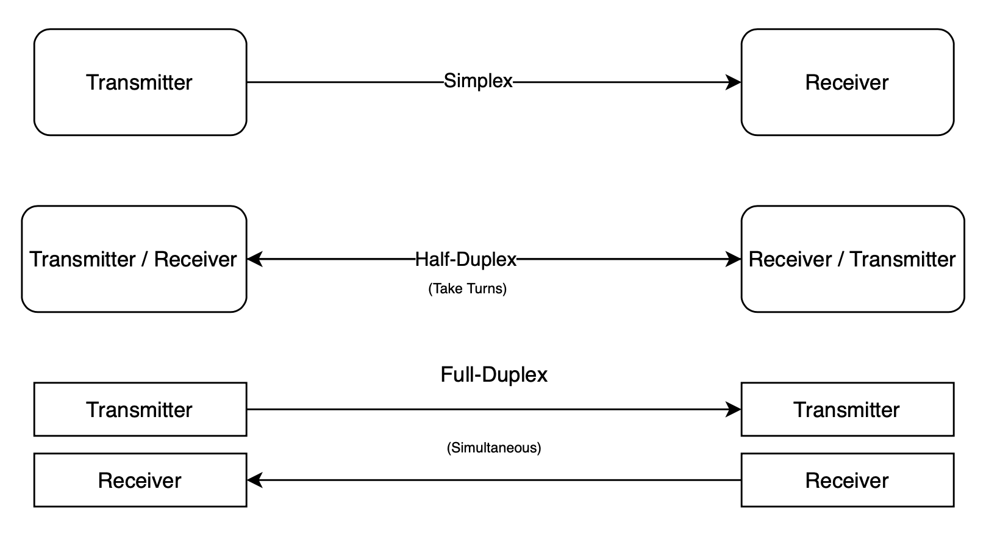
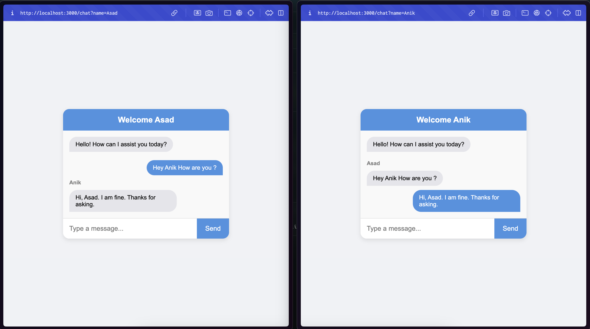

## Learn Socket for Chat App

WebSocket is a computer communications protocol, providing full-duplex communication channels over a single TCP connection. The WebSocket protocol was standardized by the IETF as RFC 6455 in 2011. The current API specification allowing web applications to use this protocol is known as WebSockets.

We are going to using Web Sockets for realtime communication with server to client. When we decide to build a notification system or a messaging system into our application or the application should like only for messaging staff.

There is 2 Web Sockets in the world is most popular.

1. WebSocket
2. Socket.io

### And What is WebSocket now?

WebSocket is ***a bidirectional communication protocol that can send the data from the client to the server or from*** the server to the client by ...

### Why we use WebSocket?

The WebSocket API is an advanced technology that makes it possible to **open a two-way interactive communication session between the user's browser and a server**. With this API, you can send messages to a server and receive event-driven responses without having to poll the server for a reply.

### So What is Socket.io?

Socket.IO is ***a library that enables low-latency, bidirectional and event-based communication between a client and a server***. ... It is built on top ...

### Why Socket.io use for?

Socket.IO was created in 2010. It was developed **to use open connections to facilitate realtime communication**, still a relatively new phenomenon at the time. Socket.IO allows bi-directional communication between client and server.



**`Full-Duplex Communication:`** Unlike traditional web communication (HTTP). Where the client sends a request and waits for a response. WebSockets allow for bidirectional communication. Both the client and server can send messages to each other independently.

**`Low Latency:`** WebSockets reduce latency compared to traditional HTTP polling methods because they establish a persistent connection, eliminating the need to repeatedly open and close connections for each exchange.

**`Real-time Communication:`** WebSockets are commonly used for real-time applications such as chat applications, financial trading platforms, and live sports updates. They enable the server to push data to the connected clients instantly.

**`WebSocket API:`** Both the browser and server provide APIs for working with WebSockets. In a web browser, the JavaScript WebSocket API is used to establish and manage WebSocket connections. On the server side, various programming languages and frameworks provide WebSocket support.

## Difference between HTTP and WebSocket

HTTP (Hypertext Transfer Protocol) and WebSocket are both communication protocols, but they serve different purpose and have distinct  characteristic’s.

**Communication Type:**

**`HTTP:`** It is a request-response protocol. The client sends a request to the server, and the server responds to that request. This is a unidirectional communication model.

**`WebSocket:`** It provides full-duplex communication. Both the client and server can send messages independently at any time, allowing for bidirectional communication.

## Connection Lifecycle

**`HTTP:`** It follows a request-response model, where a new connection is established for each request, and its is closed after the response is received. This can result in higher latency, especially for applications requiring real-time updates.

**`WebSocket:`** It establishes a persistent connection between the client and server, allowing for continuous communication. The connection is established with a handshake, and once open, it can be used for multiple messages in both directions without the need to reopen the connection each time.

## Usage

**`HTTP:`** Primarily used for traditional web browsing, where a client requests a webpage, and the server responds with the requested content. It is also used for RESTful APIs.

**`WebSocket:`** Well-suited for real-time applications where low latency and bidirectional communication are crucial, such as chat applications, online gaming, financial platforms, and live updates.

## Socket IO and Emit Cycle

### `Emit`

We can send message from Server to all connected Clients. We can use `emit` for sending message with webSocket connections. Let’s see one of the example here.

**⇒ Server Example**

```tsx
import express, { Request, Response } from 'express';
import http from 'http';
import { Server as SocketServer } from 'socket.io';

const app = express();
const httpServer = http.createServer(app);
const io = new SocketServer(httpServer);

// Connection Event..
io.on('connection', (socket) => {
	// Send Message from server..
	socket.emit('message-from-server', 'Hello I am a Server Message');
	
	// Receive Message from client..
	socket.on('message', (message) => {
		console.log('CLIENT MESSAGE - ', message);
	});
	
	// Disconnection Event..
	io.on('disconnect', () => {
		console.log('Socket server disconnected');
	});
});

httpServer.listen();
```

**⇒ Client Example**

```tsx
const socket = io("ws://localhost:3000");

// Receive Message from the Server
socket.on('message-from-server', (message) => {
	console.log('SERVER MESSAGE - ', message);
});

// Send Message to the Server..
socket.emit('message', 'Hey there I am from Client');
```

### `Broadcast Emit`

Let’s do the broadcasting the message from Server. `broadcast` is the system where you can send the message or data to other servers which connected to the same server, we won’t be getting our own message or data, only connected end users can receives the message or data.

**⇒ Server Example**

```tsx
import express, { Request, Response } from 'express';
import http from 'http';
import { Server as SocketServer } from 'socket.io';

const app = express();
const httpServer = http.createServer(app);
const io = new SocketServer(httpServer);

// Connection Event..
io.on('connection', (socket) => {
	// Send Broadcast Message from server..
	// First it will listen from .on event then it will send in callback
	socket.on('message', (data) => {
		socket.broadcast.emit('send-message', data);
	});
	
	// Disconnection Event..
	io.on('disconnect', () => {
		console.log('Socket server disconnected');
	});
});

httpServer.listen();
```

**⇒ Client Example**

```tsx
const socket = io("ws://localhost:3000");

// Receive Message from the Server..
socket.on('send-message', (message) => {
	console.log('SERVER MESSAGE - ', message);
});

// Send Message to the Server..
socket.emit('message', 'Hey there I am from Client');
```

## Lets build a simple Chat system
**→ Lets see our chatting app how its looks like, We are going yo build this Chat application.**

Here we can chat with opponents by entering username from the home page, and then start chatting with others. Connected users can able to reply your message and you can also send message with broadcasting way of chatting.



Server file to run express + socket, this is the setup and the server logic

- **⇒ `src/server.ts`**
    
    ```tsx
    import express, { Request, Response } from 'express';
    import http from 'http';
    import path from 'path';
    import { Server } from 'socket.io';
    
    const app = express();
    const port = 3000;
    
    app.use(express.static(path.join(__dirname, "../public")));
    
    // region Server with Socket
    const httpServer = http.createServer(app);
    const io = new Server(httpServer);
    
    io.on('connection', (socket) => {
        console.log('Socket server connected');
    
        // Send a message to the client
        socket.emit('message', "Welcome to the Chat Server!");
    
        // Receive a message from the client
        socket.on('client-message', (data) => {
            // Send the message to all connected clients
            socket.broadcast.emit('server-message', data);
        });
    
        // Receive the Typing Event from Client..
        socket.on('typing-client', (data) => {
            // Send the message to all connected clients
            socket.broadcast.emit('typing-server', data);
        });
    
        io.on('disconnect', () => {
            console.log('Socket server disconnected');
        });
    });
    
    // region Routes
    app.get('/', (req: Request, res: Response) => {
        res.sendFile(path.join(__dirname, "../public/views/index.html"));
    });
    
    app.get('/chat', (req: Request, res: Response) => {
       res.sendFile(path.join(__dirname, "../public/views/chat.html")); 
    });
    
    // region Listen Server
    httpServer.listen(port, () => {
        console.log(`Server is running on port ${port}`);
    });
    ```
    

Now we have to write client end coding for chat home here, HTML public page for client can provide name here to start conversations.

- **⇒ `public/views/index.html`**
    
    ```html
    <!DOCTYPE html>
    <html lang="en">
    
    <head>
        <meta charset="UTF-8">
        <meta name="viewport" content="width=device-width, initial-scale=1.0">
        <title>Home</title>
        <link rel="stylesheet" href="../css/style.css">
        <script src="/socket.io/socket.io.js" async defer></script>
        <script src="../js/home.js" async defer></script>
    </head>
    
    <body>
        <div class="chat-container">
            <div class="chat-header">Hi to Chat Engine</div>
    
            <h1>Enter Your Name</h1>
            <form id="basic-info-form">
                <input type="text" id="input-name" placeholder="Enter your name">
            </form>
        </div>
    </body>
    
    </html>
    ```
    

Now after home HTML we have to make chat page for user can chatting,

- **⇒ `public/views/chat.html`**
    
    ```html
    <!DOCTYPE html>
    <html lang="en">
    
    <head>
        <meta charset="UTF-8">
        <meta name="viewport" content="width=device-width, initial-scale=1.0">
        <title>Chat</title>
        <link rel="stylesheet" href="../css/style.css">
        <script src="/socket.io/socket.io.js" async defer></script>
        <script src="../js/chat.js" async defer></script>
    </head>
    
    <body>
        <div class="chat-container">
            <!-- Chat Header Section -->
            <div class="chat-header">Welcome <span class="chat-with"></span></div>
    
            <!-- Message Section -->
            <div class="chat-messages" id="chat-messages">
                <div class="message bot">Hello! How can I assist you today?</div>
                <div class="typing-indicator"></div>
            </div>
    
            <!-- Chat Input Section -->
            <div class="chat-input">
                <input type="text" id="user-input" placeholder="Type a message...">
                <!-- <button onclick="sendMessage()">Send</button> -->
                <button id="send-msg-btn">Send</button>
            </div>
        </div>
    </body>
    
    </html>
    ```
    

We need CSS for these files to design our UI looking like awesome.  And this one will helps us to having wonderful interaction within chatting.

- **⇒ `public/css/style.css`**
    
    ```css
    * {
        margin: 0;
        padding: 0;
        box-sizing: border-box;
        font-family: "Arial", sans-serif;
    }
    
    body {
        background-color: #f0f2f5;
        display: flex;
        justify-content: center;
        align-items: center;
        height: 100vh;
    }
    
    /* CHAT CONTAINER FOR WINDOW OF MESSENGER */
    .chat-container {
        width: 400px;
        max-width: 90%;
        background-color: #fff;
        border-radius: 15px;
        box-shadow: 0 4px 10px rgba(0, 0, 0, 0.1);
        display: flex;
        flex-direction: column;
        overflow: hidden;
    }
    
    /* MESSENGER HEADER SECTION */
    .chat-header {
        background-color: #4a90e2;
        color: white;
        padding: 15px;
        text-align: center;
        font-size: 1.2rem;
        font-weight: bold;
    }
    
    /* CHATS CONTAINER FOR SENDER/RECEIVER */
    .chat-messages {
        flex: 1;
        padding: 15px;
        overflow-y: auto;
        display: flex;
        flex-direction: column;
        gap: 10px;
        background-color: #f9f9f9;
    }
    
    /* MESSAGE BUBBLE */
    .message {
        max-width: 70%;
        padding: 10px 15px;
        border-radius: 20px;
        position: relative;
        word-wrap: break-word;
        font-size: 0.9rem;
    }
    
    /* MESSAGE FROM USER/OWN-MESSAGE */
    .message.user {
        background-color: #4a90e2;
        color: white;
        align-self: flex-end;
        border-bottom-right-radius: 0;
    }
    
    /* MESSAGE FROM BOT/SENDER-MESSAGE */
    .user-name.bot {
        font-size: small;
        font-weight: bold;
        color: gray;
    }
    
    .message.bot {
        background-color: #e5e5ea;
        color: black;
        align-self: flex-start;
        border-bottom-left-radius: 0;
    }
    
    /* INPUT CHAT SECTION */
    .chat-input {
        display: flex;
        border-top: 1px solid #ddd;
        background-color: #fff;
    }
    
    .chat-input input {
        flex: 1;
        padding: 15px;
        border: none;
        outline: none;
        font-size: 1rem;
    }
    
    .chat-input button {
        background-color: #4a90e2;
        color: white;
        border: none;
        padding: 15px 20px;
        cursor: pointer;
        font-size: 1rem;
    }
    
    .chat-input button:hover {
        background-color: #357abd;
    }
    
    /* TYPING INDICATING... */
    .typing-indicator {
        font-size: x-small;
        color: gray;
        max-height: fit-content;
    }
    ```
    

So, we are done with UI design and the Server Logics and setting Socket with Backend server. Now we have to make client JavaScript logics for UI interaction and socket interacting with chat.

- **⇒ `public/js/home.js`**
    
    ```jsx
    const inputName = document.querySelector('#input-name');
    const inputForm = document.querySelector('#basic-info-form');
    
    inputForm.addEventListener('submit', (event) => {
        event.preventDefault();
        const userName = inputName.value;
        window.location.href = `http://localhost:3000/chat?name=${userName}`;
    });
    ```
    

And this one is for chat engine clients logics,

- **⇒ `public/js/chat.js`**
    
    ```jsx
    const socket = io("ws://localhost:3000");
    
    // region Add User Name to Chat
    let userName = '';
    (() => {
        const urlParams = new URLSearchParams(window.location.search);
        const userNameParam = urlParams.get('name');
        if (!userNameParam) {
            window.location.href = 'http://localhost:3000';
        }
        // Added user name to chat
        userName = userNameParam;
        document.querySelector('.chat-with').innerHTML = userNameParam;
    })();
    
    // region Append Message
    function appendMessage(data = { messageText: '', userName: '' }) {
        const chatMessages = document.getElementById('chat-messages');
        const botMessage = document.createElement('div');
        const botName = document.createElement('div');
    
        // Message Sender Name Add..
        botName.classList.add('user-name', 'bot');
        botName.textContent = data.userName;
    
        // Bot Message Class and Text Add..
        botMessage.classList.add('message', 'bot');
        botMessage.textContent = data.messageText;
    
        // Chat Messages..
        chatMessages.appendChild(botName);
        chatMessages.appendChild(botMessage);
        chatMessages.scrollTop = chatMessages.scrollHeight;
    }
    
    // region Send Message
    function sendMessage() {
        const userInput = document.getElementById('user-input');
        const messageText = userInput.value.trim();
        if (messageText === '') return;
    
        // Chat Messages
        const chatMessages = document.getElementById('chat-messages');
    
        // Add user message
        const userMessage = document.createElement('div');
        userMessage.classList.add('message', 'user');
        userMessage.textContent = messageText;
        chatMessages.appendChild(userMessage);
    
        console.log('Message text here - ', messageText);
        // Send Message to Server..
        socket.emit('client-message', { messageText, userName });
    
        // Clear input
        userInput.value = '';
        // Scroll to the bottom
        chatMessages.scrollTop = chatMessages.scrollHeight;
    
        // Simulate bot response as Demo use to check the reply styles
        // setTimeout(() => {
        //     appendMessage();
        // }, 1000);
    }
    
    // region Add Typing UI..
    function addTypingUI(username = '') {
        const typingIndicator = document.querySelector('.typing-indicator');
        typingIndicator.textContent = `${username} is typing...`;
    
        // Clear Typing UI 
        setTimeout(() => {
            typingIndicator.textContent = '';
        }, 3000);
    }
    
    // Allow sending message with Enter key
    // region Enter Key to Submit
    document.getElementById('user-input').addEventListener('keypress', function (event) {
        if (event.key === 'Enter') {
            sendMessage();
        }
    });
    
    // region Send Message Button
    document.getElementById('send-msg-btn').addEventListener('click', function (event) {
        event.preventDefault();
        sendMessage();
    });
    
    // region Key Pressing Event
    document.getElementById('user-input').addEventListener('keydown', function (event) {
        if (event.key) {
            // Send Typing Event to Server
            socket.emit('typing-client', { userName });
        }
    });
    
    // region Socket Client..
    // Receive messages from the Server
    socket.on('server-message', (data) => {
        // Append Message to UI..
        appendMessage(data);
    });
    
    // region Typing Event..
    socket.on('typing-server', (data) => {
        console.log(`${data.userName} is typing...`);
        // Add Typing UI..
        addTypingUI(data.userName);
    });
    ```
    

<aside>
💡

Now we are done with our Simple Chat Application using Node (Express) + Socket.IO

</aside>